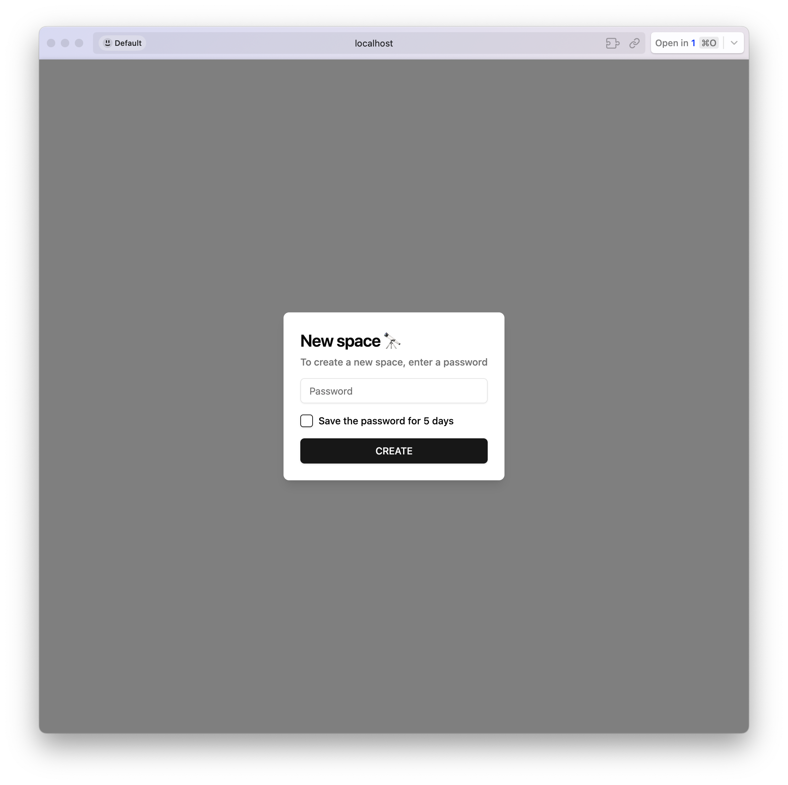
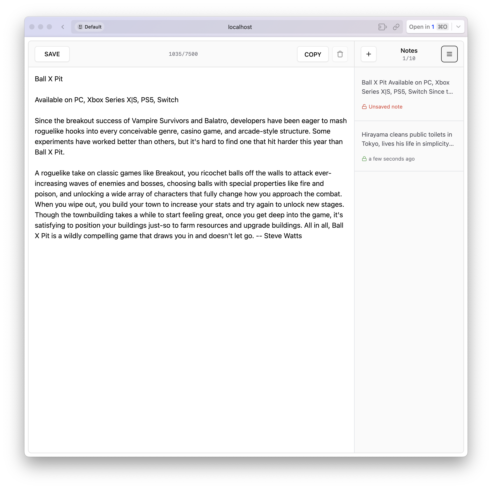
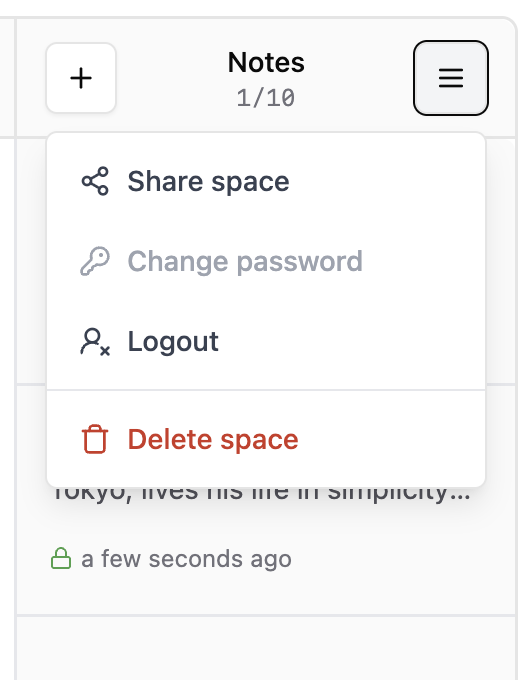

# `sendtext.me`

[](https://kit.svelte.dev/)
[](https://www.typescriptlang.org/)
[](https://www.prisma.io/)
[](https://tailwindcss.com/)
[](https://bun.sh/)

A secure, real-time, ephemeral note-sharing web application.

`sendtext.me` allows you to create private, password-protected "spaces" to share notes and text snippets. Notes are synchronized in real-time with everyone who has access to the space, making it perfect for quick collaboration or sharing information between your own devices.

## 🖼️ Preview

<table>
  <tr>
    <td align="center">Create a new space</td>
    <td align="center">Main UI</td>
    <td align="center">Mobile UI</td>
  </tr>
  <tr>
    <td></td>
    <td></td>
    <td></td>
  </tr>
</table>

## ✨ Main Features

- **🔒 Secure Spaces**: Every space is protected by a password.
- **🚀 Real-time Collaboration**: Notes are updated instantly across all connected clients using Server-Sent Events (SSE).
- **🔗 Shareable Links**: Spaces are accessible via unique, hard-to-guess URLs.
- **🤫 Ephemeral Sessions**: Access to spaces is session-based and can expire, enhancing privacy.
- **📱 Mobile-Friendly**: Responsive design that works on all devices.
- **⚡️ Fast & Lightweight**: Built with SvelteKit and Bun for optimal performance.
- **🛡️ Secure by Design**:
    - Passwords are securely hashed using `bcrypt`.
    - Protection against brute-force attacks with rate limiting.
    - Potential for end-to-end encryption of notes (client-side encryption logic is in place).

## 🛠️ Tech Stack

- **Framework**: [SvelteKit](https://kit.svelte.dev/)
- **Language**: [TypeScript](https://www.typescriptlang.org/)
- **Runtime**: [Bun](https://bun.sh/)
- **Database ORM**: [Prisma](https://www.prisma.io/)
- **Database**:
    - [SQLite](https://www.sqlite.org/) for local development.
    - [Neon](https://neon.tech/) (PostgreSQL) for production.
- **Styling**: [Tailwind CSS](https://tailwindcss.com/) with [Bits UI](https://www.bits-ui.com/)
- **Real-time Engine**: Server-Sent Events (SSE)

## 🚀 Getting Started

### Prerequisites

- [Bun](https://bun.sh/docs/installation)
- [Node.js](https://nodejs.org/) (for `npx` if you don't use `bunx`)

### Installation & Setup

1.  **Clone the repository:**
    ```bash
    git clone https://github.com/your-username/sendtext-me_sveltekit.git
    cd sendtext-me_sveltekit
    ```

2.  **Install dependencies:**
    ```bash
    bun install
    ```

3.  **Set up environment variables:**
    
    Create a `.env` file by copying the example file:
    ```bash
    cp .env.example .env
    ```
    The default configuration uses a local SQLite database and should work out of the box.

4.  **Initialize the database:**
    
    This command will create the SQLite database file and apply the necessary schema.
    ```bash
    bun run db:gen:sqlite
    ```

5.  **Run the development server:**
    ```bash
    bun run dev
    ```

    The application should now be running on [http://localhost:5173](http://localhost:5173).

## Usage

1.  Open the application in your browser.
2.  You will be prompted to create a new "space". Enter a password for your space.
3.  You will be redirected to your new space, which has a unique URL in the address bar.
4.  Share this URL with anyone you want to share notes with. They will need the password to enter the space.
5.  Start typing in the text area. The content will be saved and updated in real-time for all participants.

## 📜 Scripts

- `bun run dev`: Starts the development server.
- `bun run build`: Creates a production build of the.
- `bun run preview`: Previews the production build locally.
- `bun run check`: Runs Svelte check for type checking.
- `bun run db:gen:sqlite`: Generates Prisma client and pushes the schema for SQLite.
- `bun run db:gen:neon`: Generates Prisma client for Neon (Postgres).